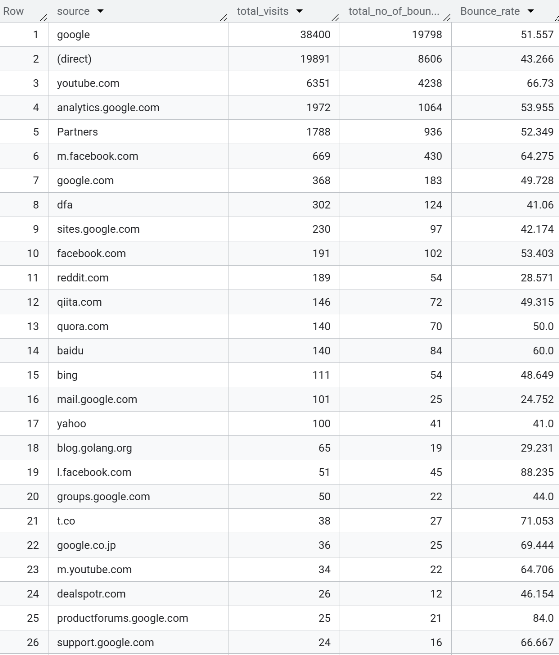
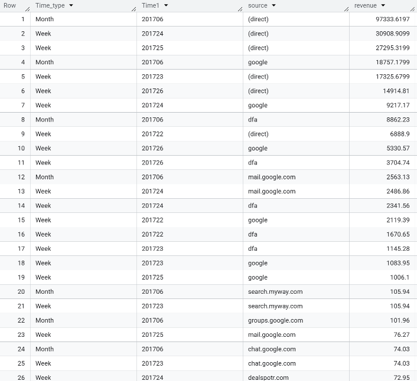
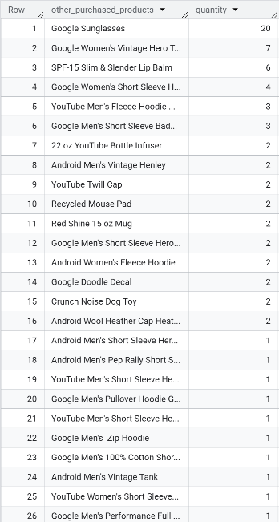

# E-commerce Business Analytics Project (SQL)

## 📌 Project Overview
This project analyzes **e-commerce performance and user behavior** using SQL on the **Google Analytics public dataset**.  
The goal is to uncover **traffic quality, engagement patterns, revenue drivers, repeat purchase behavior, and conversion funnel efficiency** to support data-driven business decisions.

**Dataset**
- Google Analytics Sample Dataset (BigQuery Public)
- Time period: **January – July 2017**

**Tools**
- Google BigQuery (Standard SQL)

---

## 🎯 Business Objectives
- Evaluate overall e-commerce performance and conversion efficiency  
- Identify high-intent traffic sources and revenue drivers  
- Compare engagement between purchasers and non-purchasers  
- Analyze repeat purchase behavior and monetization efficiency  
- Identify funnel bottlenecks and cross-selling opportunities  

---

## 📊 Business Questions & Key Insights

---

### 1️⃣ Overall E-commerce Performance
**Query 01 – E-commerce Performance Overview (Jan–Mar 2017)**  
This query calculates total visits, pageviews, and transactions by month to evaluate short-term performance trends.

### 🧮 SQL Code
Question: Calculate total visit, pageview, transaction for Jan, Feb and March 2017 (order by month)
 
```sql
-- Step 1: Generate month in YYYYMM format
WITH raw_1_3 AS (
    SELECT
        *,
        FORMAT_DATE('%Y%m', PARSE_DATE('%Y%m%d', date)) AS month
    FROM `bigquery-public-data.google_analytics_sample.ga_sessions_2017*`
    WHERE _table_suffix BETWEEN '0101' AND '0331'
)

-- Step 2: Aggregate visits, pageviews, and transactions by month
SELECT
    month,
    SUM(totals.visits) AS visits,
    SUM(totals.pageviews) AS pageviews,
    SUM(totals.transactions) AS transactions
FROM raw_1_3
GROUP BY month
ORDER BY month;
```

**Results**
| Month  | Visits | Pageviews | Transactions |
|--------|--------|-----------|--------------|
| 201701 | 64,694 | 257,708   | 713          |
| 201702 | 62,192 | 233,373   | 733          |
| 201703 | 69,931 | 259,522   | 993          |


**Insight**
- Transactions grew faster than visits, indicating **improving conversion efficiency**.
- March shows a strong performance uplift, suggesting a suitable period for scaling campaigns or inventory.

---

### 2️⃣ Traffic Quality by Source
**Query 02 – Traffic Quality Analysis (Bounce Rate by Source)**
This query evaluates traffic quality by calculating bounce rates across acquisition sources to identify high-intent and low-engagement channels.

### 🧮 SQL Code
Question: Bounce rate per traffic source in July 2017 (Bounce_rate = num_bounce/total_visit) (order by total_visit DESC)

```sql
--- Filter for source and total visits,total bounces
WITH raw_data AS(SELECT trafficSource.source AS source,
      SUM(totals.visits) AS total_visits,
      SUM(totals.bounces) AS total_no_of_bounces
      FROM `bigquery-public-data.google_analytics_sample.ga_sessions_201707*`
      GROUP BY trafficSource.source  )

SELECT source, total_visits, total_no_of_bounces,
      ROUND((total_no_of_bounces*100/total_visits),3) AS Bounce_rate
FROM raw_data
ORDER BY total_visits DESC;
```

**Results**



**Insight**
- **High-intent channels (Direct, Email)** show lower bounce rates and stronger engagement.
- High-volume social traffic exhibits weak engagement, highlighting optimization opportunities.
- Traffic quality is more important than raw traffic volume.

---

### 3️⃣ Revenue Drivers by Traffic Source
**Query 03 – Revenue Analysis by Traffic Source**
This query analyzes revenue contribution by traffic source over time to identify the most effective channels for monetization.

### 🧮 SQL Code
Question: Revenue by traffic source by week, by month in June 2017
```sql
--- Create Month and add Time &Time_type column
WITH Raw_Month AS(SELECT *, 
      FORMAT_DATE('%Y%m', PARSE_DATE('%Y%m%d', date)) AS Time1,
      'Month' AS Time_type
      FROM `bigquery-public-data.google_analytics_sample.ga_sessions_201706*`),
--- Create Week
      Raw_Week AS(SELECT *, 
            FORMAT_DATE('%Y%W', PARSE_DATE('%Y%m%d', date)) AS Week,
            'Week' AS Time_type
      FROM `bigquery-public-data.google_analytics_sample.ga_sessions_201706*`),

--- Combine to have raw data & unnest revenue
      raw_data AS(SELECT Time_type,
                        Time1,
                        trafficSource.source AS source,
                        productRevenue AS revenue  
                  FROM Raw_Month, 
                  UNNEST (hits) hits,
                  UNNEST (hits.product) product
                  WHERE product.productRevenue is not null
                  UNION ALL
                  SELECT Time_type,
                        Week,
                        trafficSource.source AS source,
                        productRevenue AS revenue  
                  FROM Raw_Week,
                  UNNEST (hits) hits,
                  UNNEST (hits.product) product
                  WHERE product.productRevenue is not null)

SELECT Time_type, 
      Time1, 
      source, 
      ROUND(SUM(revenue)/1000000,4) AS revenue
FROM raw_data
GROUP BY Time_type, Time1, source
ORDER BY revenue DESC;
```

**Results**

*Revenue is shown in USD (millions).*



**Insight**
- **Direct traffic generates the highest revenue**, reflecting strong returning-user intent.
- Search traffic drives volume but monetizes less efficiently.
- Weekly analysis reveals campaign-driven revenue spikes.

---

### 4️⃣ Engagement Behavior: Purchasers vs Non-Purchasers
**Query 04 – Purchaser vs Non-Purchaser Engagement**
This query compares pageview behavior between purchasers and non-purchasers to assess how engagement depth correlates with conversion.

### 🧮 SQL Code
Question: Average number of pageviews by purchaser type (purchasers vs non-purchasers) in June, July 2017.

```sql
--- CTE for purchaser (generate YYYYMM & avg pageview)
WITH purchaser_data AS(SELECT FORMAT_DATE('%Y%m', PARSE_DATE('%Y%m%d', date)) AS month,
                        SUM(totals.pageviews) AS total_pageview,
                        COUNT(DISTINCT fullVisitorId) AS no_unique_user,
                        SUM(productRevenue) AS revenue,
                        ROUND(SUM(totals.pageviews)/COUNT(DISTINCT fullVisitorId),2) AS avg_pageviews_purchase
                FROM `bigquery-public-data.google_analytics_sample.ga_sessions_2017*`,
                        UNNEST (hits) hits,
                        UNNEST (hits.product) product
                WHERE _table_suffix between '0601' and '0731'
                        AND productRevenue IS NOT NULL
                GROUP BY FORMAT_DATE('%Y%m', PARSE_DATE('%Y%m%d', date)) 
                HAVING SUM(totals.transactions)>=1),

--- CTE for non-purchaser (generate YYYYMM & avg pageview)
non_purchaser_data AS(SELECT FORMAT_DATE('%Y%m', PARSE_DATE('%Y%m%d', date)) AS month,
                        SUM(totals.pageviews) AS total_pageview,
                        COUNT(DISTINCT fullVisitorId) AS no_unique_user,
                        SUM(productRevenue) AS revenue,
                        ROUND(SUM(totals.pageviews)/COUNT(DISTINCT fullVisitorId),2) AS avg_pageviews_non_purchase
                FROM `bigquery-public-data.google_analytics_sample.ga_sessions_2017*`,
                        UNNEST (hits) hits,
                        UNNEST (hits.product) product
                WHERE _table_suffix between '0601' and '0731'
                        AND productRevenue IS NULL
                        AND totals.transactions IS NULL
                GROUP BY FORMAT_DATE('%Y%m', PARSE_DATE('%Y%m%d', date)))

--- Combine 2 data of non_purchase & purchase
SELECT purchaser_data.month,avg_pageviews_purchase,avg_pageviews_non_purchase
FROM purchaser_data
INNER JOIN non_purchaser_data
ON purchaser_data.month = non_purchaser_data.month
ORDER BY purchaser_data.month;
```

**Results**
| Month  | Avg Pageviews (Purchasers) | Avg Pageviews (Non-Purchasers) |
|--------|----------------------------|--------------------------------|
| 201706 | 94.02                      | 316.87                         |
| 201707 | 124.24                     | 334.06                         |

**Insight**
- Purchasers consistently demonstrate **much deeper engagement** than non-purchasers.
- Pageview depth is a strong leading indicator of purchase intent.
- Improving content discovery and internal linking can support conversion growth.

---

### 5️⃣ Purchase Frequency Analysis
**Query 05 – Purchase Frequency Analysis**
This query calculates the average number of transactions per purchasing user to evaluate repeat purchase behavior and customer value.

### 🧮 SQL Code
Questions: Average number of transactions per user that made a purchase in July 2017

```sql
--- Generate format YYYYMM 
SELECT FORMAT_DATE('%Y%m', PARSE_DATE('%Y%m%d', date)) AS month,
--- Caluclate avg number of transactions per user= total transactions/ total unique vistors
      ROUND(SUM(totals.transactions)/COUNT(DISTINCT fullVisitorId),2) AS Avg_total_transactions_per_user
FROM `bigquery-public-data.google_analytics_sample.ga_sessions_201707*`,
  UNNEST (hits) hits,
  UNNEST (hits.product) product
--- Filter the purchaser only
WHERE productRevenue IS NOT NULL
AND product.productRevenue IS NOT NULL
GROUP BY FORMAT_DATE('%Y%m', PARSE_DATE('%Y%m%d', date)) 
HAVING SUM(totals.transactions)>=1;
```

**Results**
| Month  | Avg Transactions per User |
|--------|---------------------------|
| 201707 | 4.16                      |

**Insight**
- Purchasing users complete multiple transactions on average.
- Indicates strong repeat purchase behavior and **high customer lifetime value (CLV) potential**.

---

### 6️⃣ Monetization Efficiency per Session
**Query 06 – Monetization Efficiency per Visit**
This query measures average revenue generated per visit from purchasing users to assess funnel efficiency and monetization performance.
### 🧮 SQL Code
Questions: Average amount of money spent per session. Only include purchaser data in July 2017

```sql
--- Generate format YYYYMM 
SELECT FORMAT_DATE('%Y%m', PARSE_DATE('%Y%m%d', date)) AS month,
---avg_spend_per_session = total revenue/ total visit
      ROUND((SUM(productRevenue)/SUM(totals.visits))/1000000,2) AS avg_revenue_by_user_per_visit
FROM `bigquery-public-data.google_analytics_sample.ga_sessions_201707*`,
  UNNEST (hits) hits,
  UNNEST (hits.product) product
--- Filter the purchaser only
WHERE productRevenue IS NOT NULL
AND product.productRevenue IS NOT NULL
GROUP BY FORMAT_DATE('%Y%m', PARSE_DATE('%Y%m%d', date)) 
HAVING SUM(totals.transactions)>=1;
```

**Results**
| Month  | Avg Revenue per Visit (USD) |
|--------|-----------------------------|
| 201707 | 43.86                       |

**Insight**
- Revenue per visit is a critical KPI for evaluating funnel efficiency.
- Improvements in conversion rate or average order value directly impact revenue performance.

---

### 7️⃣ Cross-Selling Opportunities
**Query 07 – Cross-Selling Product Analysis**
This query identifies products frequently purchased together to uncover cross-selling patterns and bundling opportunities.

### 🧮 SQL Code
Questions: Other products purchased by customers who purchased product "YouTube Men's Vintage Henley" in July 2017. Output should show product name and the quantity was ordered.

```sql
-- list down visitor who purchase "YouTube Men's Vintage Henley"
WITH customer_id AS (
  SELECT DISTINCT fullVisitorId AS visitor_id
  FROM `bigquery-public-data.google_analytics_sample.ga_sessions_201707*`,
    UNNEST(hits) AS hits,
    UNNEST(hits.product) AS product
  WHERE _table_suffix BETWEEN '01' AND '31'
    AND v2ProductName = "YouTube Men's Vintage Henley"
    AND productRevenue IS NOT NULL
    AND totals.transactions >= 1)

--- Find other products that visitors above purchase
SELECT 
  v2ProductName AS other_purchased_products,
  SUM(productQuantity) AS quantity
FROM `bigquery-public-data.google_analytics_sample.ga_sessions_201707*` AS table1,
  UNNEST(hits) AS hits,
  UNNEST(hits.product) AS product
INNER JOIN customer_id
  ON table1.fullVisitorId = customer_id.visitor_id
WHERE _table_suffix BETWEEN '01' AND '31'
  AND v2ProductName != "YouTube Men's Vintage Henley"
  AND productRevenue IS NOT NULL
  AND totals.transactions >= 1
GROUP BY v2ProductName
ORDER BY quantity DESC;
```

**Results**



**Insight**
- Customers who purchase core apparel items frequently buy related accessories.
- Clear opportunities exist for **bundling and recommendation strategies** to increase AOV.

---

### 8️⃣ Conversion Funnel Performance
**Query 08 – Conversion Funnel & Cohort Analysis**
This query analyzes user progression through the conversion funnel and cohorts over time to identify drop-offs and conversion efficiency trends.

### 🧮 SQL Code
Questions: Calculate cohort map from product view to addtocart to purchase in Jan, Feb and March 2017. 

```sql
--- Create number product view & product add-to-cart by month format (YYYYMM)
WITH raw_1 AS(SELECT FORMAT_DATE('%Y%m', PARSE_DATE('%Y%m%d', date)) AS month,
  COUNT(CASE WHEN eCommerceAction.action_type = '2' THEN 1 END) AS num_product_view,
  COUNT(CASE WHEN eCommerceAction.action_type = '3' THEN 1 END) AS num_addtocart
FROM `bigquery-public-data.google_analytics_sample.ga_sessions_2017*`,
  UNNEST(hits) AS hits,
  UNNEST(hits.product) AS products
---Filter Jan, Feb, Mar 2017
WHERE _table_suffix between '0101' and '0331'
      AND (products.isImpression IS NULL OR products.isImpression = FALSE)
GROUP BY FORMAT_DATE('%Y%m', PARSE_DATE('%Y%m%d', date))),

--- Create number product purchase by month format (YYYYMM)
raw_2 AS(SELECT FORMAT_DATE('%Y%m', PARSE_DATE('%Y%m%d', date)) AS month,
  COUNT(CASE WHEN eCommerceAction.action_type = '6' THEN 1 END) AS num_purchase
FROM `bigquery-public-data.google_analytics_sample.ga_sessions_2017*`,
  UNNEST(hits) AS hits,
  UNNEST(hits.product) AS products
---Filter Jan, Feb, Mar 2017
WHERE _table_suffix between '0101' and '0331'
      AND (products.isImpression IS NULL OR products.isImpression = FALSE)
      AND productRevenue IS NOT NULL
GROUP BY FORMAT_DATE('%Y%m', PARSE_DATE('%Y%m%d', date)))

---Combine 3 numbers and calculate add-to-cart rate and purchase rate
SELECT raw_1.month, 
      num_product_view,
      num_addtocart,
      num_purchase,
---Add_to_cart_rate = number product  add to cart (3)/number product view(2)
      ROUND(num_addtocart*100/num_product_view,2) AS Add_to_cart_rate,
---Purchase_rate = number product purchase(6)/number product view. 
      ROUND(num_purchase*100/num_product_view,2) AS Purchase_rate
FROM raw_1
INNER JOIN raw_2
ON raw_1.month = raw_2.month
ORDER BY month;
```

**Results**
| Month  | Product Views | Add to Cart | Purchases | Add-to-Cart Rate (%) | Purchase Rate (%) |
|--------|---------------|-------------|-----------|----------------------|-------------------|
| 201701 | 25,787        | 7,342       | 2,143     | 28.47                | 8.31              |
| 201702 | 21,489        | 7,360       | 2,060     | 34.25                | 9.59              |
| 201703 | 23,549        | 8,782       | 2,977     | 37.29                | 12.64             |

**Insight**
- Funnel efficiency improved steadily over time.
- The largest drop-off occurs after add-to-cart, but shows consistent improvement.
- UX, pricing, or promotional changes likely contributed to higher conversion rates.

---

## 🔑 Key Takeaways
- Conversion efficiency improved faster than traffic growth.
- **High-intent traffic sources** drive disproportionate revenue.
- Engagement depth strongly correlates with purchase behavior.
- Repeat purchases and cross-selling present high-ROI growth opportunities.
- Funnel optimization offers meaningful upside without increasing traffic spend.

---

## 🚀 Next Steps
- Build an interactive Power BI dashboard for performance monitoring  
- Segment users by value and behavior for deeper analysis  
- Extend analysis to customer lifetime value (CLV) and retention modeling  
